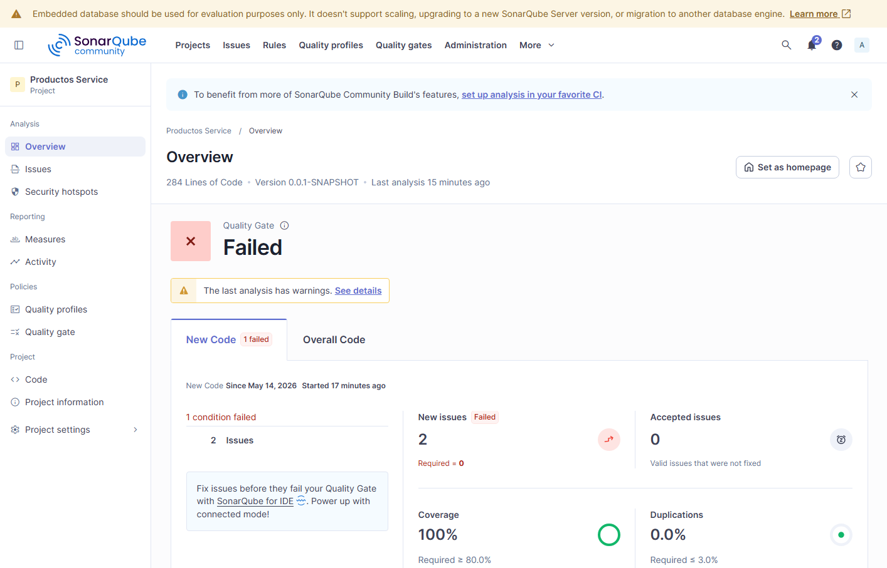
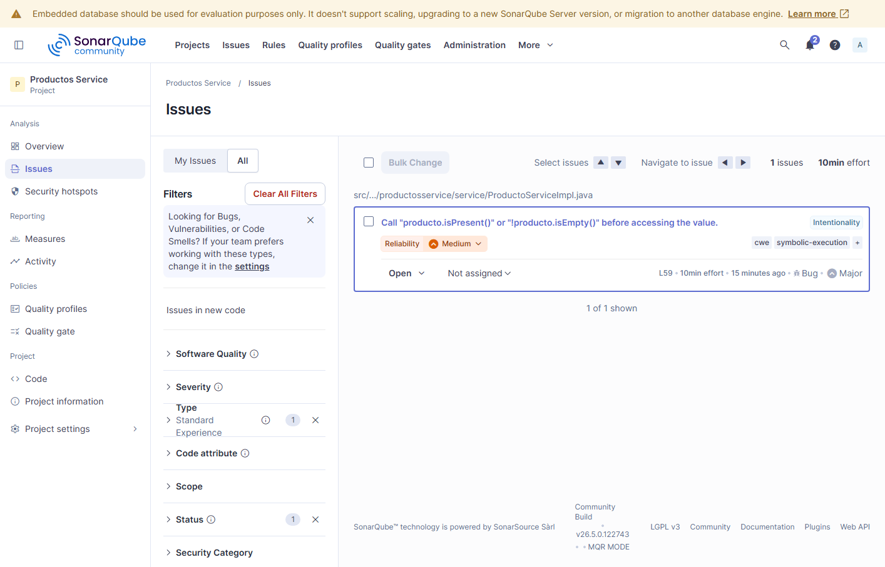
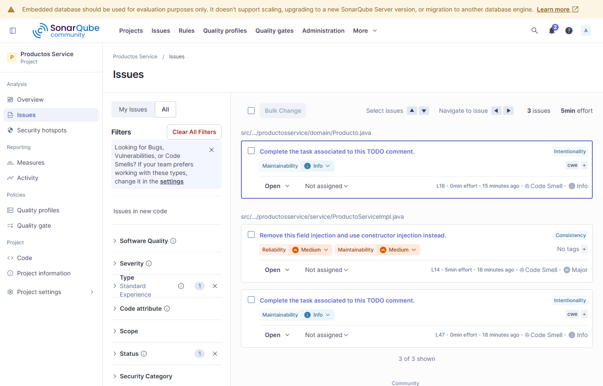

# Productos Service - Analisis SonarQube

Proyecto Spring Boot para el laboratorio de la Unidad 10: Metricas de Calidad y
SonarQube. El codigo conserva problemas intencionales de calidad para ejecutar
el analisis inicial, revisar el dashboard y documentar los hallazgos.

## Prerrequisitos

| Herramienta | Version/uso |
| --- | --- |
| Java | JDK 21 o superior. Verificado localmente con Java 25.0.2 compilando con release 21 |
| Maven | Maven Wrapper incluido: `.\mvnw.cmd` |
| Docker Desktop | Requerido para SonarQube local |
| IntelliJ IDEA | Importar como proyecto Maven y ejecutar los comandos desde Terminal |

## Levantar SonarQube

```powershell
docker run -d --name sonarqube -p 9000:9000 -e SONAR_ES_BOOTSTRAP_CHECKS_DISABLE=true sonarqube:community
docker ps
docker logs sonarqube
```

Acceder a `http://localhost:9000` con `admin / admin`, cambiar la contrasena y
crear el proyecto:

| Campo | Valor |
| --- | --- |
| Project name | `Productos Service` |
| Project key | `com.universidad:productos-service` |

## Ejecutar el build y JaCoCo

```powershell
.\mvnw.cmd clean verify
```

El comando compila, ejecuta pruebas y genera el reporte XML de JaCoCo en:

```text
target/site/jacoco/jacoco.xml
```

## Ejecutar el analisis SonarQube

En PowerShell conviene envolver los argumentos `-D` entre comillas simples:

```powershell
.\mvnw.cmd sonar:sonar `
  '-Dsonar.host.url=http://localhost:9000' `
  '-Dsonar.projectKey=com.universidad:productos-service' `
  '-Dsonar.projectName=Productos Service' `
  '-Dsonar.token=TU_TOKEN'
```

El dashboard queda disponible en:

```text
http://localhost:9000/dashboard?id=com.universidad%3Aproductos-service
```

## Estado inicial del analisis

Resultados reales del analisis ejecutado el 14 de mayo de 2026:

| Categoria | Cantidad | Rating |
| --- | ---: | --- |
| Bugs | 1 | C |
| Vulnerabilidades | 1 | D |
| Code Smells | 3 | A |
| Cobertura | 69.4% | - |

## Hallazgos principales identificados

### Bug 1: Acceso a Optional sin verificar presencia

- Archivo: `src/main/java/com/universidad/productosservice/service/ProductoServiceImpl.java`, linea 59
- Descripcion: el metodo `buscar` llama `producto.get()` sin validar `isPresent()` o `isEmpty()`, lo que puede lanzar `NoSuchElementException`.
- Severidad: Major

### Vulnerabilidad 1: Entidad persistente usada como cuerpo de entrada REST

- Archivo: `src/main/java/com/universidad/productosservice/controller/ProductoController.java`, linea 42
- Descripcion: el endpoint `POST /api/productos` recibe directamente la entidad JPA `Producto`; SonarQube recomienda usar un DTO/POJO simple.
- Severidad: Critical

### Code Smell 1: Inyeccion por campo

- Archivo: `src/main/java/com/universidad/productosservice/service/ProductoServiceImpl.java`, linea 14
- Descripcion: `ProductoRepository` se inyecta con `@Autowired` sobre un campo; SonarQube recomienda inyeccion por constructor.
- Severidad: Major

### Code Smell 2: TODO pendiente en entidad

- Archivo: `src/main/java/com/universidad/productosservice/domain/Producto.java`, linea 18
- Descripcion: queda documentada una tarea pendiente para mover logica de estado fuera de la entidad JPA.
- Severidad: Info

### Code Smell 3: TODO pendiente en servicio

- Archivo: `src/main/java/com/universidad/productosservice/service/ProductoServiceImpl.java`, linea 47
- Descripcion: queda pendiente implementar la logica de categoria y proveedor.
- Severidad: Info

## Capturas del dashboard







## Checkpoints verificados

| Checkpoint | Estado |
| --- | --- |
| Contenedor `sonarqube` corriendo en Docker | Verificado con `docker ps` |
| Dashboard local carga en `localhost:9000` | Verificado y capturado |
| `sonar-project.properties` en la raiz | Completado |
| Plugin JaCoCo con `prepare-agent` y `report` | Completado |
| `.\mvnw.cmd clean verify` | `BUILD SUCCESS`, 23 pruebas, 0 fallos |
| Reporte JaCoCo XML | Generado en `target/site/jacoco/jacoco.xml` |
| Analisis SonarQube | `BUILD SUCCESS` |
| App Spring Boot inicia sin errores de contexto | Verificado con `java -jar target/productos-service-0.0.1-SNAPSHOT.jar` |
| Capturas en `docs/` | `sonar-dashboard.png`, `sonar-bugs.png`, `sonar-code-smells.png` |

## Entregables

- `README.md` con instrucciones, tabla de resultados, hallazgos y capturas.
- `sonar-project.properties` en la raiz.
- Codigo fuente en `src/` con problemas intencionales para el analisis inicial.
- Reporte JaCoCo generado por `.\mvnw.cmd clean verify`.
- Capturas de SonarQube en `docs/`.
- Historial Git con mas de 3 commits descriptivos.
