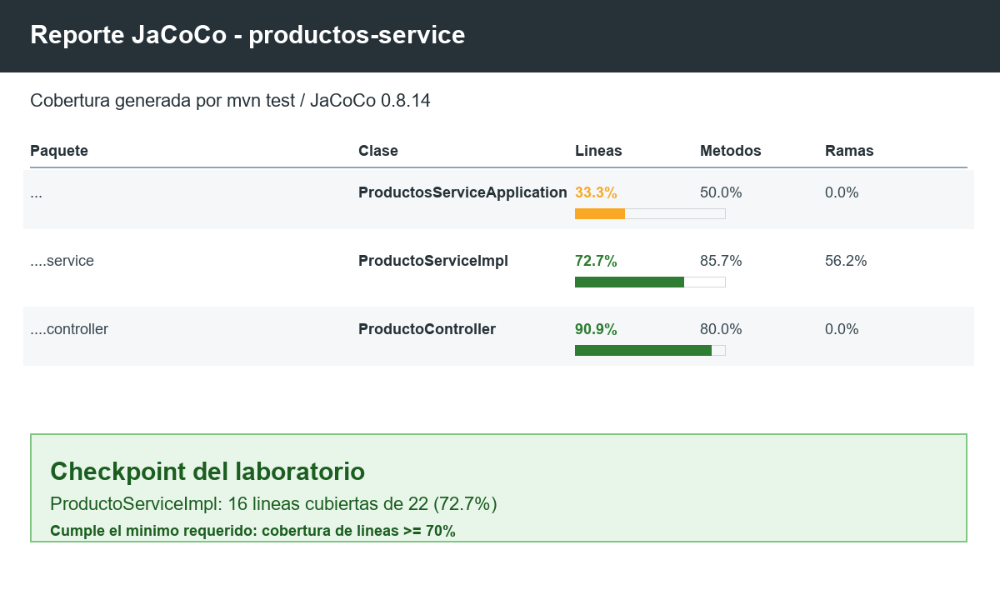

# Productos Service


Microservicio REST para gestionar productos, desarrollado con Spring Boot, Java 21,
Spring Data JPA y Maven. Este proyecto corresponde al Post-Contenido 2 de la
Unidad 9 e incluye pruebas unitarias, pruebas de integración para persistencia,
pruebas web del controlador REST y reporte de cobertura con JaCoCo.

## Tecnologias

| Tecnologia | Uso |
| --- | --- |
| Java 21 | Lenguaje base del proyecto |
| Spring Boot 4 | Framework del microservicio |
| Spring Web MVC | Capa REST |
| Spring Data JPA | Persistencia |
| H2 Database | Base de datos en memoria para pruebas |
| JUnit 5 | Motor de pruebas |
| Mockito | Mocks de la capa de servicio |
| JaCoCo | Reporte de cobertura |
| GitHub Actions | Integracion continua |

## Estructura

```text
src/
  main/java/com/universidad/productosservice/
    controller/ProductoController.java
    domain/Producto.java
    repository/ProductoRepository.java
    service/ProductoService.java
    service/ProductoServiceImpl.java
  test/java/com/universidad/productosservice/
    controller/ProductoControllerTest.java
    repository/ProductoRepositoryTest.java
    service/ProductoServiceImplTest.java
  test/resources/application-test.properties
.github/workflows/ci.yml
docs/jacoco-report.png
```

## Endpoints

| Metodo | Ruta | Descripcion |
| --- | --- | --- |
| GET | `/api/productos` | Lista todos los productos |
| GET | `/api/productos/{id}` | Busca un producto por ID |
| POST | `/api/productos` | Crea un producto |

## Ejecutar las pruebas

```bash
mvn test
mvn verify
```

`mvn test` ejecuta las pruebas y genera `target/site/jacoco/index.html`.
`mvn verify` es el comando usado por el pipeline de GitHub Actions.

## Pruebas implementadas

| Clase | Tipo | Casos cubiertos |
| --- | --- | --- |
| `ProductoServiceImplTest` | Unitarias | Creacion, listado, busqueda, validaciones, normalizacion y eliminacion |
| `ProductoRepositoryTest` | `@DataJpaTest` | Guardar, buscar por ID, listar y eliminar con H2 |
| `ProductoControllerTest` | `@WebMvcTest` | Listar productos, crear producto y respuesta 404 |

Resultado local verificado:

```text
Tests run: 23, Failures: 0, Errors: 0, Skipped: 0
BUILD SUCCESS
```

## Cobertura

La cobertura de lineas de `ProductoServiceImpl` es 72.7%, por encima del minimo
solicitado de 70%.



## CI/CD

El workflow `.github/workflows/ci.yml` se ejecuta en cada `push` o
`pull_request` hacia `main` o `master`, compila el proyecto, corre `mvn verify` y
sube el artefacto `jacoco-report` con el reporte de cobertura.

## Entregables del laboratorio

- Proyecto Maven con codigo fuente en `src/`.
- Pruebas de repositorio con `@DataJpaTest`.
- Pruebas de controlador con `@WebMvcTest`.
- Configuracion de H2 en `src/test/resources/application-test.properties`.
- Pipeline de GitHub Actions en `.github/workflows/ci.yml`.
- Reporte JaCoCo generado en `target/site/jacoco/index.html`.
- Evidencia de cobertura incluida en `docs/jacoco-report.png`.
