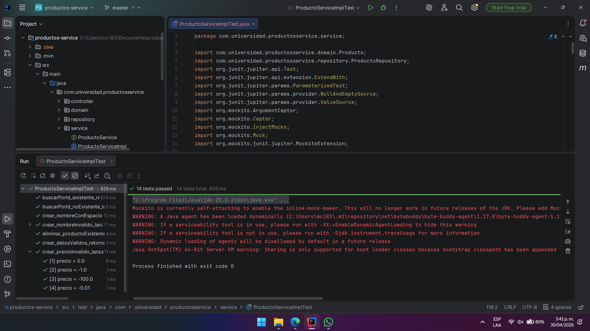

# productos-service — Post-Contenido 1, Unidad 9

**Patrones de Diseño de Software · Ingeniería de Sistemas · 2026**  
Universidad de Santander (UDES)

---

## Descripción del Proyecto

Microservicio de gestión de productos desarrollado con Spring Boot 3.3 y Java 21.
El proyecto implementa una suite completa de pruebas unitarias sobre la capa de
servicio, aplicando JUnit 5 y Mockito para aislar la lógica de negocio de sus
dependencias externas (repositorio JPA), verificar comportamientos con assertions
específicas, y cubrir escenarios de error mediante pruebas parametrizadas y
captura de argumentos con `ArgumentCaptor`.

---

## Tecnologías Utilizadas

| Tecnología         | Versión   | Rol en el proyecto                        |
|--------------------|-----------|-------------------------------------------|
| Java               | 21        | Lenguaje de implementación                |
| Spring Boot        | 3.3.x     | Framework base del microservicio          |
| Spring Data JPA    | (incluido)| Capa de persistencia                      |
| H2 Database        | (incluido)| Base de datos en memoria para pruebas     |
| Lombok             | (incluido)| Reducción de código boilerplate           |
| JUnit 5 (Jupiter)  | (incluido)| Motor de ejecución de pruebas             |
| Mockito            | (incluido)| Framework de Test Doubles                 |
| Maven              | 3.9+      | Gestión de dependencias y build           |

> Las versiones marcadas como "(incluido)" son gestionadas automáticamente
> por `spring-boot-starter-test` a través del BOM de Spring Boot 3.3.

---

## Estructura del Proyecto

```
productos-service/
├── src/
│   ├── main/
│   │   └── java/com/universidad/productosservice/
│   │       ├── ProductosServiceApplication.java
│   │       ├── domain/
│   │       │   └── Producto.java               ← Entidad JPA
│   │       ├── repository/
│   │       │   └── ProductoRepository.java     ← JpaRepository<Producto, Long>
│   │       ├── service/
│   │       │   ├── ProductoService.java        ← Interfaz de negocio
│   │       │   └── ProductoServiceImpl.java    ← Implementación con validaciones
│   │       └── controller/
│   │           └── ProductoController.java     ← REST Controller
│   └── test/
│       └── java/com/universidad/productosservice/
│           └── service/
│               └── ProductoServiceImplTest.java ← Suite completa de pruebas
├── README.md
└── pom.xml
```

---

## Reglas de Negocio Implementadas

`ProductoServiceImpl` aplica las siguientes validaciones antes de persistir:

- El **nombre** no puede ser nulo, vacío ni contener solo espacios en blanco.
  Los espacios al inicio y al final se normalizan automáticamente con `strip()`.
- El **precio** debe ser un valor estrictamente mayor a cero.
- El **stock** no puede ser negativo (se acepta el valor cero).

Toda violación de estas reglas lanza `IllegalArgumentException` y garantiza
que el repositorio **no sea invocado**, como verifican las pruebas parametrizadas.

---

## Suite de Pruebas — Cobertura de Escenarios

| Prueba | Tipo | Escenario cubierto |
|--------|------|--------------------|
| `crear_datosValidos_retornaProductoGuardado` | Happy path | Creación exitosa; verifica que `save()` se llama una vez |
| `buscarPorId_existente_retornaProducto` | Happy path | Búsqueda con ID válido y existente |
| `buscarPorId_noExistente_lanzaRuntimeException` | Error | ID inexistente lanza `RuntimeException` |
| `crear_nombreInvalido_lanzaIllegalArgumentException` | Parametrizado | null, vacío, espacio, tabulador, salto de línea |
| `crear_precioInvalido_lanzaIllegalArgumentException` | Parametrizado | 0.0, -1.0, -100.0, -0.01 |
| `crear_nombreConEspacios_guardaNombreNormalizado` | ArgumentCaptor | Verifica normalización del nombre antes de persistir |
| `eliminar_productoExistente_llamaDeleteById` | Verificación de interacción | `findById` y `deleteById` se llaman exactamente una vez |


---
## pruebas exitosas
